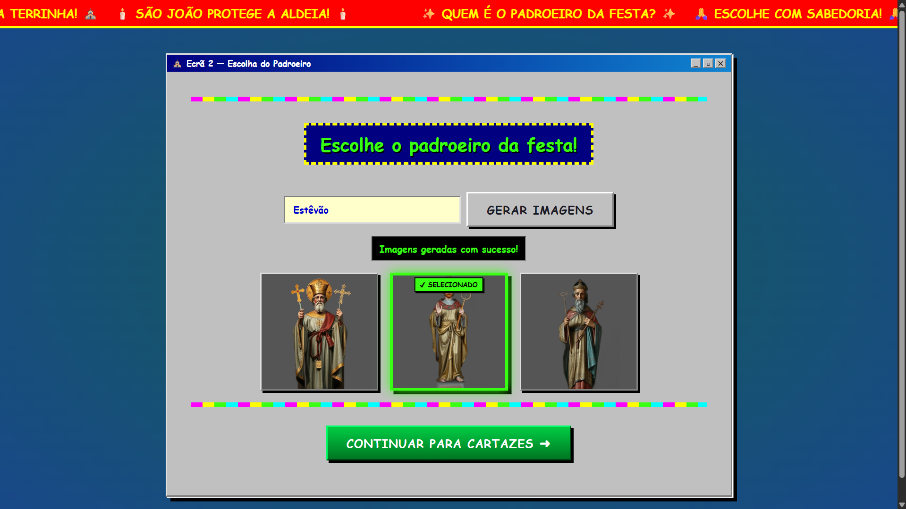

# Terrinhas Poster Generator

This project was developed for the **"Computational Creativity for Design"** course unit of the **Master's in Design and Multimedia** at the **Faculty of Sciences and Technology of the University of Coimbra (FCTUC)**.

**Authors:**

- Estêvão Abreu
- João Luiz Castanheira

---

## Screenshots




---

## Tech Stack

- **Frontend:** HTML, CSS, JavaScript, p5.js
- **Backend:** Node.js, Express
- **AI & Image Processing:**
  - Google Gemini API (`@google/genai`) for text and prompt generation
  - Hugging Face Inference API (`FLUX.1-schnell`) for image generation
  - `@imgly/background-removal-node` for automatic background removal

---

## Getting Started

### 1. Prerequisites

Ensure you have the following installed:

- **Node.js**
- **Git**

### 2. Installation

Clone the repository and install the dependencies:

```bash
# Clone the repository
git clone https://github.com/estevaoabreu/terrinha-posters-generator.git

# Go into the project folder
cd terrinha-posters-generator

# Install dependencies
npm install
```

### 3. Running the Application

```bash
node server.js
```

### 4. Environment Variables

This project requires API keys for both text and image generation. You will need to create a `.env` file in the root of the project with the following variables:

```.env
GEMINI_API_KEY=your_gemini_key_here
HUGGINGFACE_API_TOKEN=your_huggingface_token_here
```

**Google Gemini API (Text Generation):**

1. Get a free API key from [Google AI Studio](https://aistudio.google.com/).
2. Add it to your `.env` file as `GEMINI_API_KEY`.

**Hugging Face Inference API (Image Generation):**

1. Create a free account at [Hugging Face](https://huggingface.co/).
2. Go to your settings -> Access Tokens and create a new token (read access is enough).
3. Add it to your `.env` file as `HUGGINGFACE_API_TOKEN`.

The server calls the `black-forest-labs/FLUX.1-schnell` model for images. If you want to use a different model, change the `hfUrl` in `server.js`.

Note: Both services provide free tiers, but usage limits and quotas may apply.
